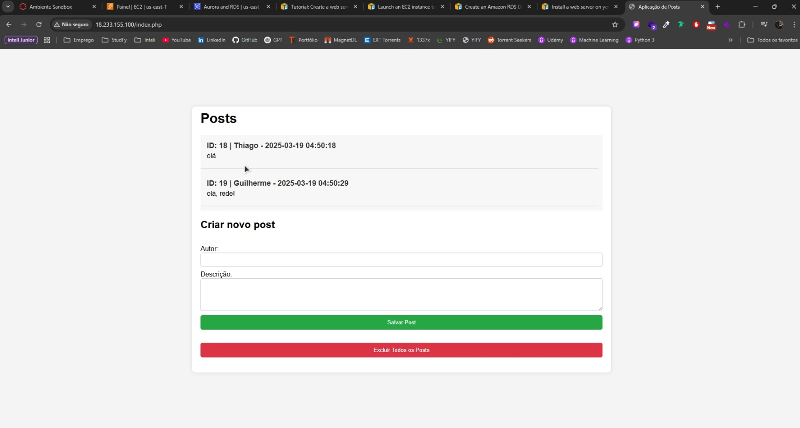

# Aplicação Web com AWS RDS e EC2

## Descrição do Projeto
Este projeto consiste em uma aplicação web simples desenvolvida em PHP com integração a um banco de dados MySQL hospedado na AWS RDS. O backend permite a criação e listagem de posts, utilizando uma instância EC2 para hospedar o servidor Apache e um banco de dados RDS.

O acesso para a criação da EC2 e do RDS foi possível por meio da conta da AWS Academy, utilizando o AWS Sandbox. Para manipular a instância EC2, foi utilizado o PuTTY no Windows para acessar remotamente o servidor via SSH.

## Estrutura do Repositório
```
C:.
│   README.md
│
├───assets
│       demo.mp4            # Vídeo de demonstração do deploy na AWS
│       thumbnail.jpg       # Foto de capa do vídeo
│
└───src
        config.php          # Configuração da conexão com o banco de dados
        createDatabase.sql  # Script para criação do banco e da tabela
        index.php           # Página principal da aplicação
```

## Tecnologias Utilizadas
- **AWS EC2**: Hospedagem do servidor Apache
- **AWS RDS (MariaDB)**: Gerenciamento do banco de dados
- **PHP**: Desenvolvimento do backend
- **MariaDB**: Banco de dados relacional
- **HTML, CSS e JavaScript**: Interface da aplicação

## Demonstração
Assista ao vídeo demonstrando o deploy da aplicação e a execução dos serviços na AWS:

[](https://youtu.be/SdPphL8zfO0)

📥 **Ou baixe o vídeo diretamente do repositório:**  
[Download do vídeo (demo.mp4)](assets/demo.mp4)

## Referências
- [Tutorial AWS RDS](https://docs.aws.amazon.com/AmazonRDS/latest/UserGuide/TUT_WebAppWithRDS.html)

