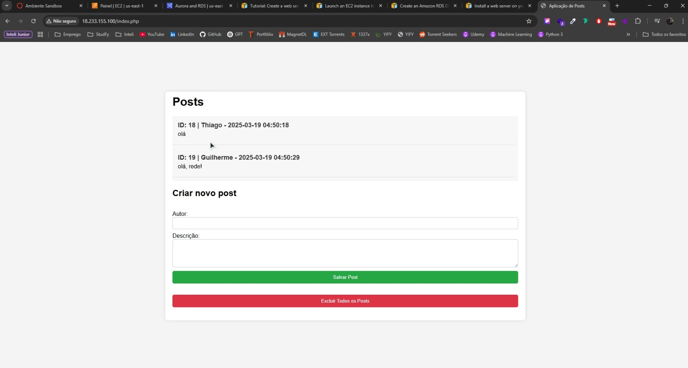

# Teste de Exibição de Vídeo no GitHub Markdown

## 🔗 Link Direto para o Vídeo
[Assista ao vídeo](assets/demo.mp4)

---

## 🎥 Tentativa de Embutir o Vídeo com HTML (pode não funcionar)
```html
<video width="600" controls>
  <source src="assets/demo.mp4" type="video/mp4">
  Seu navegador não suporta o vídeo.
</video>
```
<video width="600" controls>
  <source src="assets/demo.mp4" type="video/mp4">
  Seu navegador não suporta o vídeo.
</video>

<video src="assets/demo.mp4" width="320" height="240" controls></video>

---

## 🖼️ Thumbnail com Link para o Vídeo
[](assets/demo.mp4)

---

## 📺 Embed de Vídeo Externo (YouTube, se aplicável)
```html
<iframe width="560" height="315" src="https://drive.google.com/file/d/1V_kxkahwmmn-Y1Aof8OWUxvT600nJhfe/view?usp=sharing" frameborder="0" allowfullscreen></iframe>
```

---

<iframe width="560" height="315" src="https://drive.google.com/file/d/1V_kxkahwmmn-Y1Aof8OWUxvT600nJhfe/view?usp=sharing" frameborder="0" allowfullscreen></iframe>

---

<iframe width="560" height="315" src="https://www.youtube.com/watch?v=I6-Ar6J_5bg&ab_channel=BRKsEDU" frameborder="0" allow="accelerometer; autoplay; clipboard-write; encrypted-media; gyroscope; picture-in-picture" allowfullscreen></iframe>

---

<iframe src="https://www.youtube.com/watch?v=I6-Ar6J_5bg&ab_channel=BRKsEDU" width="480" height="270" frameBorder="0" class="giphy-embed" allowFullScreen></iframe>

---

[](https://www.youtube.com/watch?v=I6-Ar6J_5bg&ab_channel=BRKsEDU)

⚠️ **Este último método funciona apenas com vídeos hospedados externamente, como no YouTube ou Vimeo.**

